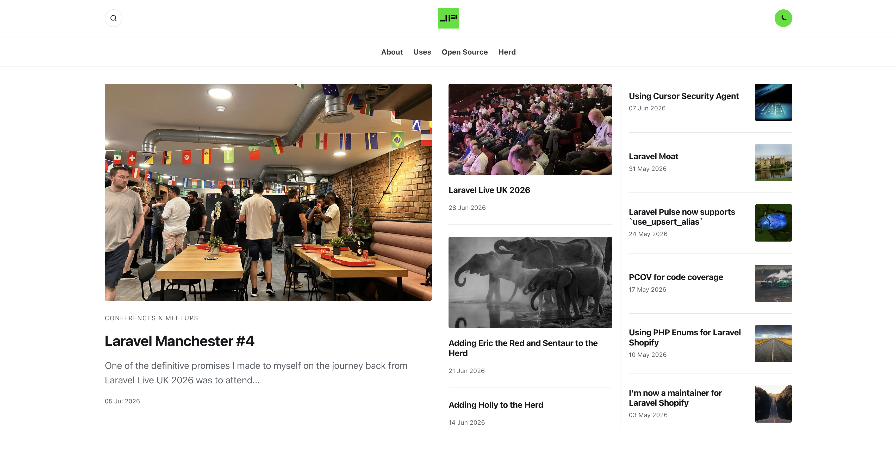

# jonathanpurvis.co.uk

Personal blog for [Jon Purvis](https://www.jonathanpurvis.co.uk/). Built with [Astro](https://astro.build/) and hosted on GitHub Pages.



## Local development

```bash
npm install
npm run dev
```

Build:

```bash
npm run build
npm run preview
```

## Writing a post

1. Copy [`POST_TEMPLATE.md`](POST_TEMPLATE.md) to `src/content/blog/YYYY-MM-DD-slug.md`.
2. Fill in the frontmatter (`title`, `slug`, `date`, `tags`, `feature_image`, optional `feature_image_credit` / `excerpt`).
3. For Unsplash headers, keep the photographer credit block from the template.
4. Commit and push to `main` — GitHub Actions deploys automatically.

## Stack

- Astro static site
- Content collections (Markdown)
- `@astrojs/sitemap` + RSS at `/rss.xml` (with `/rss/` redirect)
- Source-inspired layout (accent `#00e20b`)
